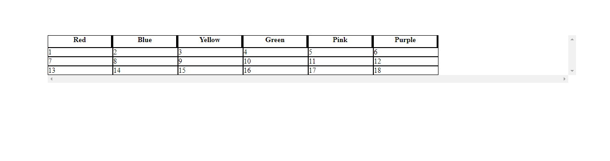

# elm-fancy-table

```shell
elm package install tlentz/elm-fancy-table
```

## Description
An elm package for an html table that has additional features such as:
* Resizing columns
* Reordering columns
* Hiding/Showing columns

## Usage

The `FancyTable.init` function creates a default Fancy Table which an empty list of headers, an empty list of rows, and both resizeColumns and reorderColumns set to True.
```elm
    tableData =
        [ ["Red 1", "Blue 1", "Yellow 1"]
        , ["Red 2", "Blue 2", "Yellow 2"]
        , ["Red 3", "Blue 3", "Yellow 3"]
        ]
    myTable =
        FancyTable.init
            |> setSettings { resizeColumns = True, reorderColumns = False, hideColumns = True }
            |> setTableHeadersFromStrings defaultHeaderSettings ["Red", "Blue", "Yellow"]
            |> setTableRows (List.map (\d -> getTableRowFromStrings d) tableData)
```

Because the Fancy Table uses mouse movements for resizing and reording columns, it requires subscriptions.
After initialization, handle the subscriptions.

```elm
subscriptions : Model -> Sub Msg
subscriptions model =
  Sub.batch
    [ Sub.map FancyTableMsg <| FancyTable.subscriptions model.fancyTable
    ]
```

Handle the updates from the subscription in your update function
```elm
update : Msg -> Model -> ( Model, Cmd Msg )
update msg ({ fancyTable } as model) =
    case msg of
        FancyTableMsg msg ->
            let
                ( updatedModel, cmd ) =
                    FancyTable.update fancyTable msg
            in
                ( Model updatedModel, Cmd.map FancyTableMsg cmd )
```

To view the table, just call the view function
```elm
Html.map FancyTableMsg <| FancyTable.view model.fancyTable
```

## Example

Checkout the [example](https://github.com/tlentz/elm-fancy-table/tree/master/example "elm-fancy-table example") to test it or see how to wire it up.

